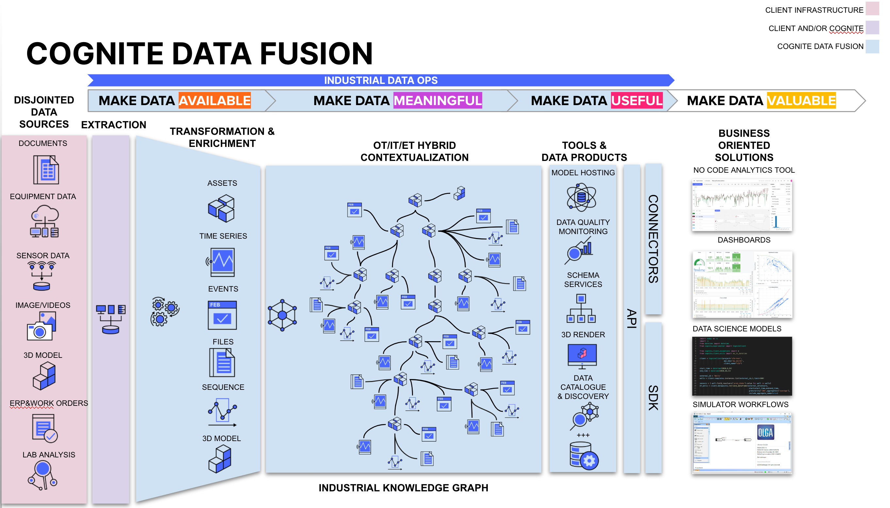

# Welcome to the Cognite Data Fusion Workshop!

This workshop will guide you through a hands-on example to develop production-ready solutions with Cognite Data Fusion (CDF). 

# Agenda

* <b>Day 1</b> (15 March 9:00am - 2:00pm)
    - Introductions (30min)
    - Demos 
        - Cognite Data Fusion Demo (60min)
        - Cognite Apps Demo (90min)

    - Pemex Use Cases and Data Discussion

    - Cognite Data Fusion - Hands On
        - Development Environment 
        - Data Integration

* <b>Day 2</b> (16 March 9:00am - 2:00pm)
    - Cognite Data Fusion - continued
        - Data Integration
        - Data Modelling

* <b>Day 3</b> (17 March 9:00am - 5:00pm)
    - Cognite Data Fusion - continued
        - Data Consumption
        - Data Ops Review
    - Wrap Up
        - Recap and next steps

# DataOps Themes

## Data Integration
- Data lifecycle
- Integrate data from different sources
- Keeping data current

## Data Governance
- Data lineage
- Access Control

## Data Modeling
- Process data for consumption

## Data Consumption
- Dashboard visualization

# Introductions

!!! CHECK
    - Kindly share your email so I can configure your access to Fusion