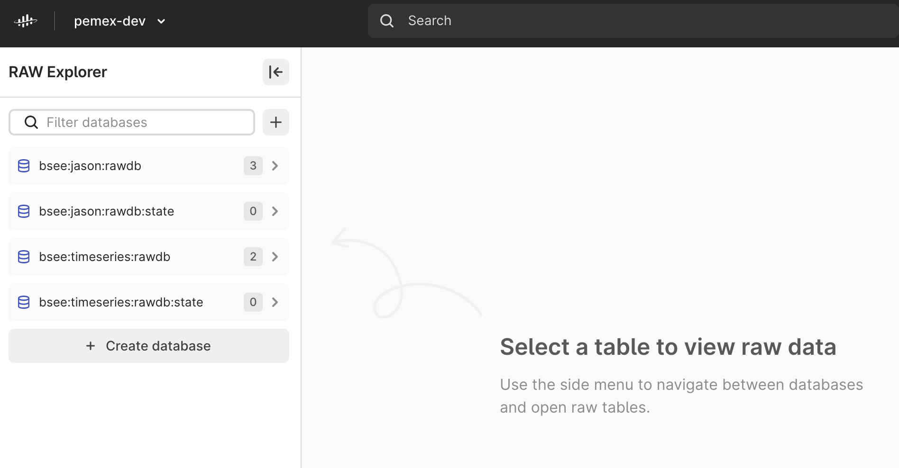
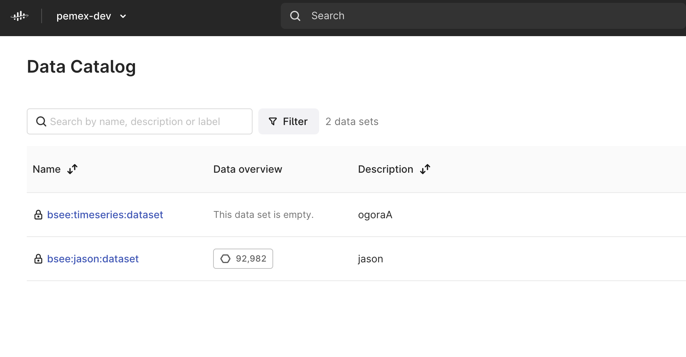
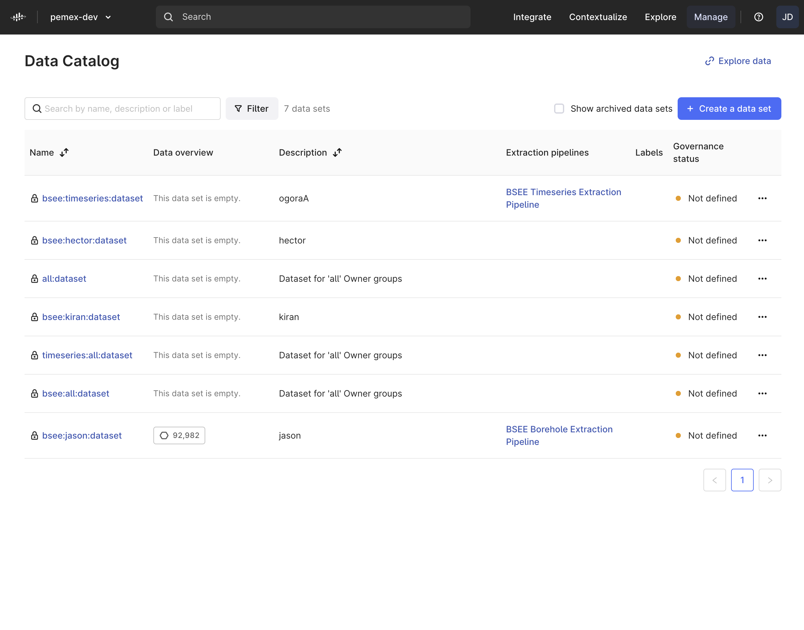
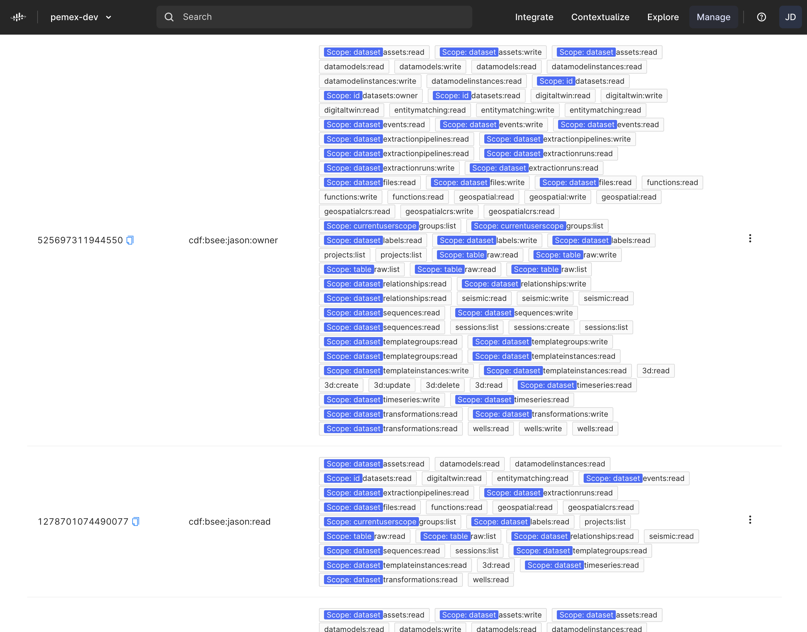

# Development Environment

To ensure that all participants have a consistent environment and avoid the need for reconfiguring your personal setup, we recommend using an Ubuntu VM (locally on your machine) pre-configured with all the development tools that you will need during the Bootcamp. These tools include:
Python 3.8
Poetry 1.2
PyCharm
gh cli
jq

!!! TODO
    - Download and Install [Virtual Box](https://www.virtualbox.org/wiki/Downloads)
        - Download and install the appropriate Virtual Box for your operating system. Depending on your Enterprise IT policy, you may need to request access to this software.
    - [Download image](https://drive.google.com/file/d/1lNgn-uLHxDNR0t1yoRH7boZTwUKVgD6o/view?usp=share_link) (~10GB, ~30min to download). Unpack .zip file.
    Note: The image has been created for VirtualBox 7.0 and is not compatible with older versions of VirtualBox. Trying to open it with an older version can cause the file to become corrupted.
    - Start Ubuntu VM (locally)
        - Start VirtualBox (give permissions, if asked)
        - Open bootcamp.vbox (located in unpacked bootcamp.zip file)
        - Start bootcamp VM (give permissions, if asked)
        - Login on Ubuntu VM (username: user (default), password: marathon)
        - If there is anything that needs to be installed, install it.

    - Open Visual Studio Code
        - git pull (refresh icon)
        - poetry install --sync

    - Open Fusion (Chrome or Firefox)
        - https://pemex.fusion.cognite.com/

## CDF Project Bootstrap

### bootstrap_cli: https://github.com/cognitedata/inso-bootstrap-cli 

### Access Control Setup

!!! TODO
    Verify CDF Access
    - CDF Raw Explorer -> 4 Databases
    
    - CDF Data Catalog -> 2 Datasets
    

### Azure Active Directory
Today: Managed by Cognite
Tomorrow: Managed by PEMEX IT

### Cognite Data Fusion (CDF)
#### Datasets

#### CDF Groups

