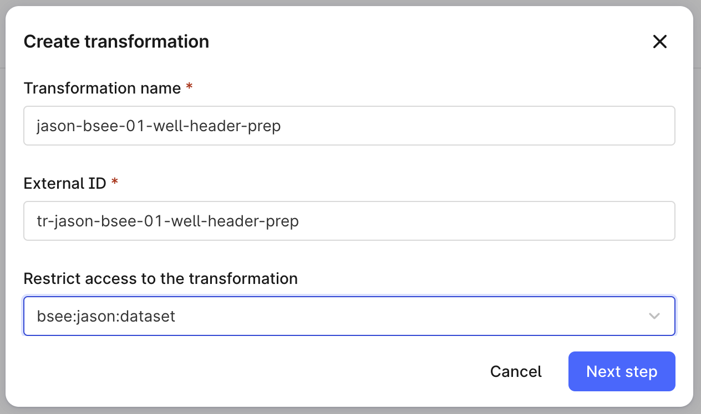

# Data Transformation

1. [Create Labels](#create-labels)
2. [Create Root Asset](#create-root-asset)
3. [Wells and Wellbores](#wells-and-wellbores)
3.0 [Well Header Prep](#well-header-prep)
3.1 [Wells](#well-assets)
3.2 [Wellbores](#wellbore-assets)
4. [Timeseries](#timeseries)


### Create Labels

With [labels](https://docs.cognite.com/dev/concepts/resource_types/labels) you can create a predefined set of managed terms that you can use to annotate and group assets, files, and relationships.  We will create a default set to be used later in our transformations.

- Upload [labels.csv](../cdf/bsee/data/labels.csv) to CDF Staging:

!!! Todo
    - Create Table 
    - Upload CSV or JSON
    - Drag the labels.csv. 
        - Select "I know the primary key".  Select "externalId".  
        - The file should successfully upload.

!!! Todo   
    - Create Labels via Transformations:
        
        
        
    - Use the Mapping Editor
        - Select the appropriate columns
        - We need to ensure we have the correct datasetId, switch to the SQL editor and add the `dataset_id('bsee:USERNAME:dataset')` line
        - Preview

!!! WARNING
    DO NOT RUN.  The Labels have been pre-created for you in a shared dataset.

!!! NOTE
    - Your transformation SQL should look something like:
    ```sql
    select
        cast(`externalId` as STRING) as externalId,
        cast(` name` as STRING) as name,
        dataset_id('bsee:jason:dataset') as dataSetId
    from
        `bsee:jason:rawdb`.`labels`;
    ```


### Create Root Asset

Root assets are the top of our asset hierarchy.  We will create a Root Asset for each user via Transformations:


!!! TODO
    - Switch to the SQL Editor
    - Paste in SQL code [create-bsee-root.sql](../cdf/bsee/transformations/create-bsee-root.sql)

    - Update the SQL code with your USERNAME

    ```sql
    select
        "BSEE USERNAME" as name,
        "bsee-USERNAME-root" as externalId,
        "USERNAME's BSEE Root Asset" as description,
        dataset_id("bsee:USERNAME:dataset") as dataSetId
    ``` 

    - Preview
    - Run as current user
    - OPTIONAL: Schedule with Client Credentials
    - Review the Run history, execution summary


!!! NOTE
    dataset_id() is a [Custom Cognite Function](https://docs.cognite.com/cdf/integration/guides/transformation/write_sql_queries/#custom-sql-functions)

Explore - You have your root asset!

### Wells and Wellbores

We will now create the Well, Wellbore asset hierarchy.  BSEE treats everything as a Borehole.  We're going to split the data into Well and Wellbore.  To do this, we first need to preprocess our borehole data in CDF Staging and write back to another CDF Staging table.

#### Well Header Prep
!!! TODO
    - Create transformation (<b>jason-bsee-01-well-header-prep</b>)
        
        
    - Switch to SQL Editor
    - Paste in SQL code [well-header-prep.sql](../cdf/bsee/transformations/well-header-prep.sql)
        ```sql
        select
            count(*) as wellbore_count,
            "Well" as type,
            substr(API_WELL_NUMBER, 1, 10) as key,
            substr(API_WELL_NUMBER, 1, 10) as API_WELL_NUMBER,
            first(SURF_LATITUDE) as SURF_LATITUDE,
            first(SURF_LONGITUDE) as SURF_LONGITUDE,
            first(SURF_LEASE_NUMBER) as SURF_LEASE_NUMBER,
            first(COMPANY_NAME) as COMPANY_NAME,
            first(WELL_NAME) as WELL_NAME,
            first(WELL_TYPE_CODE) as WELL_TYPE_CODE,
            first(WELL_SPUD_DATE) as WELL_SPUD_DATE,
            first(WATER_DEPTH) as WATER_DEPTH,
            first(RKB_ELEVATION) as RKB_ELEVATION
        from
            -- ENSURE YOU HAVE THE CORRECT SOURCE TABLE
            `bsee:jason:rawdb`.`boreholes`
        group by
            substr(API_WELL_NUMBER, 1, 10)
        order by
            wellbore_count desc,
            API_WELL_NUMBER asc
        ```

    - Preview
    - Run


#### Well Assets
Let us now add Wells to our asset hierarchy.

!!! NOTE
    We're going to create a single Well Root asset under our existing BSEE Root.  Why?  For this workshop, it keeps our data nicely organized.
    - Create a transformation like we did above when creaing the the BSEE Root.
        - jason-bsee-02-well-root
    - Change the sql to match your user.

    ```sql
    select
        "BSEE Well Root" as name,
        "bsee-jason-root-well" as externalId,
        "bsee-jason-root" as parentExternalId,
        dataset_id("bsee:jason:dataset") as dataSetId
    ```

!!! TODO
    - Create transformation (<b>jason-bsee-02-well-assets</b>)
        
        
    - Switch to SQL Editor
    - Paste in SQL code [well-assets.sql](../cdf/bsee/transformations/well-assets.sql)

    ```sql
        with
        bsee_well_assets as (
            select
                -- ENSURE YOU USE THE CORRECT PREFIX
                'bsee-jason-well-' || substr(API_WELL_NUMBER, 1, 10) as externalId,
                'bsee-jason-root-well' as parentExternalId,
                WELL_NAME as name,
                WELL_TYPE_CODE as description,
                'Well' as type,
                'bsee' as source,
                -- ENSURE YOU USE THE CORRECT Dataset
                dataset_id('bsee:jason:dataset') as dataSetId,
                array('label-bsee', 'label-bsee-well') as labels,
                *
            from
                `bsee:jason:rawdb`.`well-header-prep`
        )
        select
            externalId,
            parentExternalId,
            dataSetId,
            name,
            description,
            source,
            labels,
            to_metadata_except(
                array(
                    "name",
                    "externalId",
                    "parentExternalId",
                    "parentId",
                    "dataSetId",
                    "description",
                    "key"
                ),
                *
            ) as metadata
        from
            bsee_well_assets
    ```
    - Preview
    - Run
    - Explore your Well Assets (you should see 38054 Well Header Assets)

!!! NOTE
    - externalId 
    - parentExternalId
    - `to_metadata_execept()`


#### Wellbore Assets
Let us now add Wellbores to our asset hierarchy.

!!! TODO
    - Create transformation (<b>jason-bsee-03-wellbore-assets</b>)
        
        
    - Switch to SQL Editor
    - Paste in SQL code [wellbore-assets.sql](../cdf/bsee/transformations/wellbore-assets.sql)
        ```sql
        with
        bsee_wellbore_assets as (
            select
                'bsee-jason-wellbore-' || API_WELL_NUMBER as externalId,
                'bsee-jason-well-' || substr(API_WELL_NUMBER, 1, 10) as parentExternalId,
                WELL_NAME || '-' || WELL_NAME_SUFFIX as name,
                BOREHOLE_STAT_CD as description,
                'Wellbore' as type,
                'bsee' as source,
                dataset_id('bsee:jason:dataset') as dataSetId,
                array('label-bsee', 'label-bsee-wellbore') as labels,
                *
            from
                -- NOTE THAT WE ARE USING THE BOREHOLES TABLE
                `bsee:jason:rawdb`.`boreholes`
        )
        select
            externalId,
            parentExternalId,
            dataSetId,
            name,
            description,
            source,
            labels,
            to_metadata_except(
                array(
                "name",
                "externalId",
                "parentExternalId",
                "parentId",
                "dataSetId",
                "description",
                "key"
                ),
                *
        ) as metadata
        from
            bsee_wellbore_assets
        ```
    Preview
    Run
    Explore your Asset Hierarchy (you should see 38054 Well Header Assets + 54928 Wellbores)

!!! Note
    Transformation Scheduling

    Data Exploration
    - Data set
    - ExternalId Prefix
    - Labels
    - Metadata (area_code:gc)

### Timeseries
!!! Note
    Recall that >41 Million rows of Monthly production data has been preloaded
    [Timeseries Extraction](./02-data-extraction.md#time-series)

We are now going to leverage that data to create Time Series resources types in CDF.

The data is structured that for a given Month timestamp, values are recorded

!!! TODO
    - Create transformation (<b>jason-bsee-04-timeseries</b>)
        
        
    - Switch to SQL Editor
    - Paste in SQL code [timeseries.sql](../cdf/bsee/transformations/timeseries.sql)
        ```sql

        ```
    Preview
    Run
    Explore the Time Series resources created in CDF.  Note that we have only created placeholder.  We will populate datapoints in the next step.
