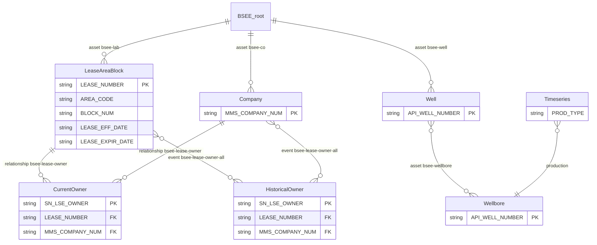

# BSEE

1. [Introduction](./00-index.md)
2. [Data Extraction](./02-data-extraction.md)
3. [Data Transformation](./03-data-transformation.md)

## BSEE Data Overview

```mermaid
erDiagram
    BSEE_root ||--o{ Company : "asset bsee-co"
    Company {
        string MMS_COMPANY_NUM PK
    }
    BSEE_root ||--o{ LeaseAreaBlock : "asset bsee-lab"
    LeaseAreaBlock {
        string LEASE_NUMBER PK
        string AREA_CODE
        string BLOCK_NUM
        string LEASE_EFF_DATE
        string LEASE_EXPIR_DATE
    }

    LeaseAreaBlock ||--o{ CurrentOwner : "relationship bsee-lease-owner"
    Company ||--o{ CurrentOwner : "relationship bsee-lease-owner"
    CurrentOwner {
        string SN_LSE_OWNER PK
        string LEASE_NUMBER FK
        string MMS_COMPANY_NUM FK
    }

    LeaseAreaBlock }o--o{ HistoricalOwner : "event bsee-lease-owner-all"
    Company }o--o{ HistoricalOwner: "event bsee-lease-owner-all"
    HistoricalOwner {
        string SN_LSE_OWNER PK
        string LEASE_NUMBER FK
        string MMS_COMPANY_NUM FK
    }
    
    BSEE_root ||--o{ Well : "asset bsee-well"
    Well {
        string API_WELL_NUMBER PK
    }
    Well }o--o{ Wellbore : "asset bsee-wellbore"
    Wellbore {
        string API_WELL_NUMBER PK
    }

    Timeseries }o--|| Wellbore : "production"
    Timeseries {
        string PROD_TYPE
    }

```