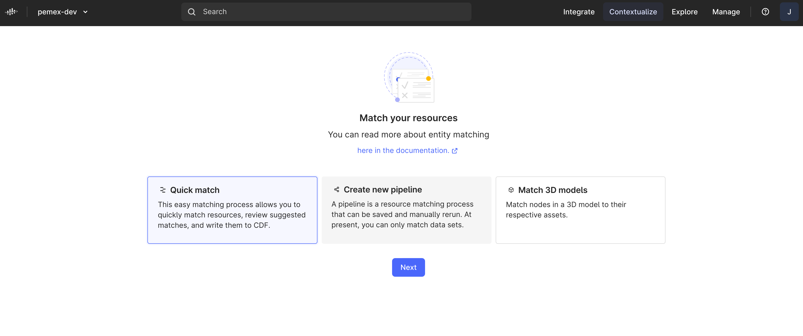
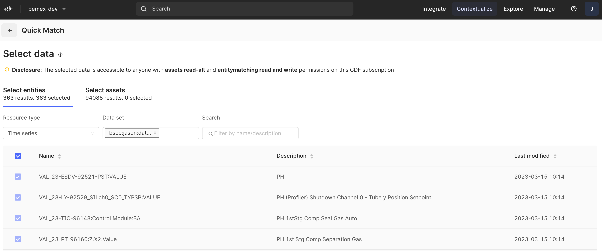
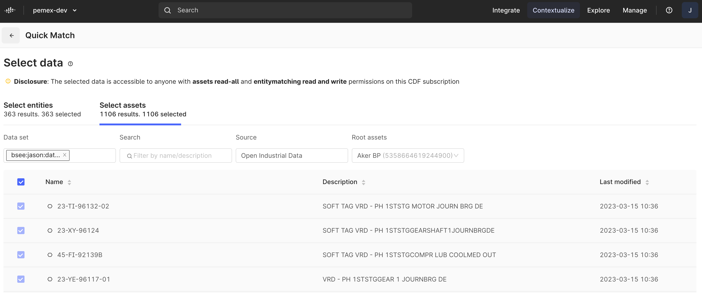
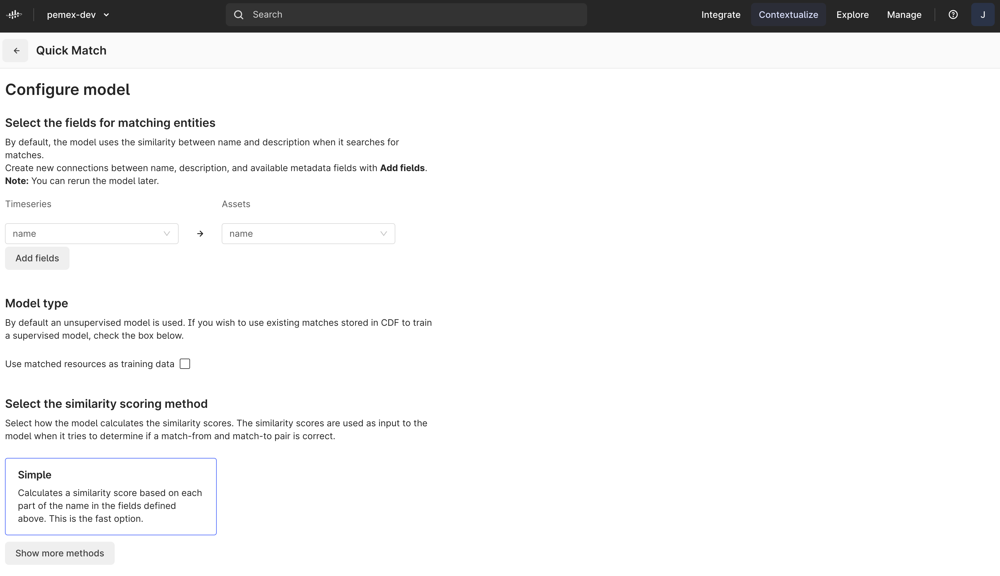
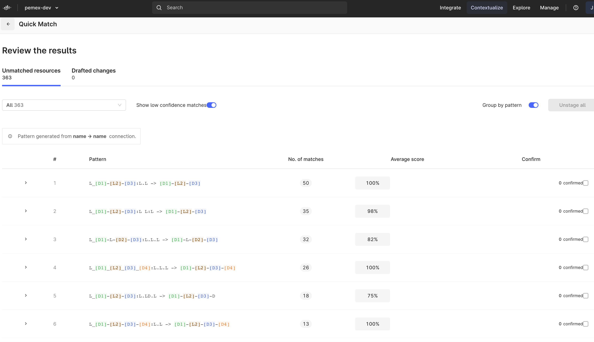
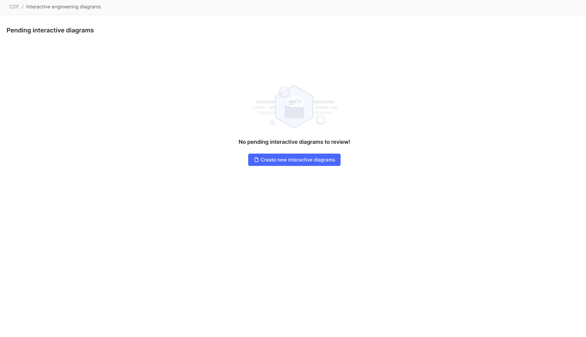
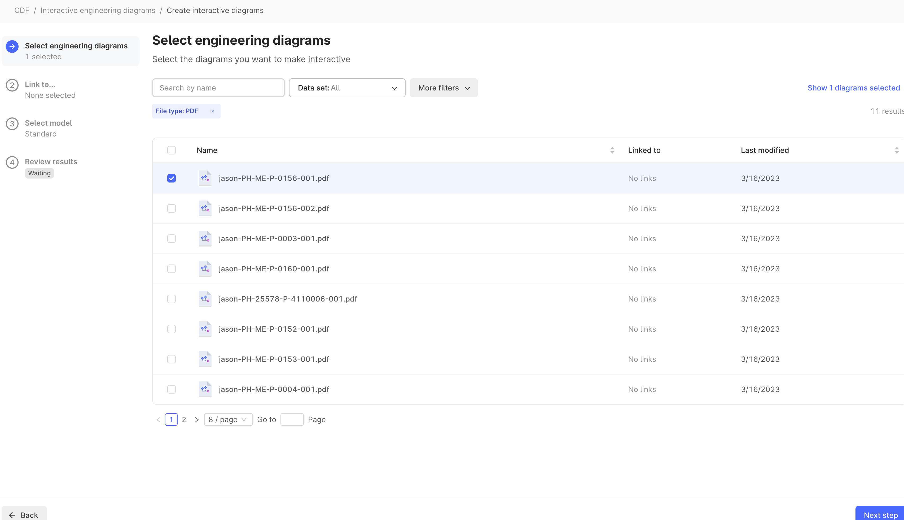
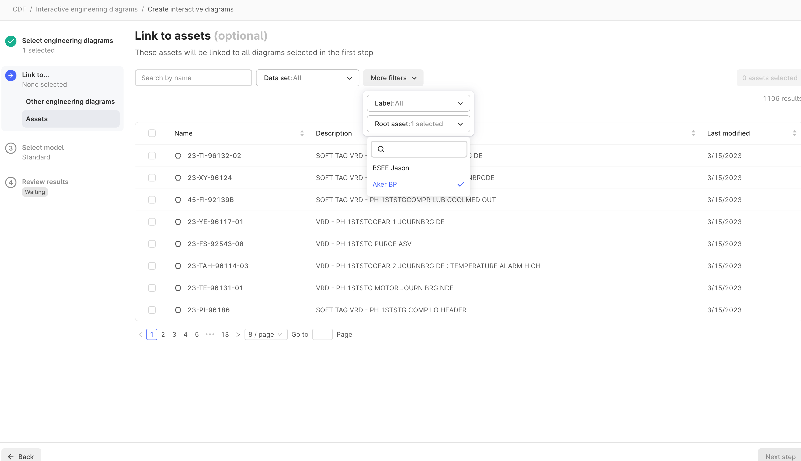
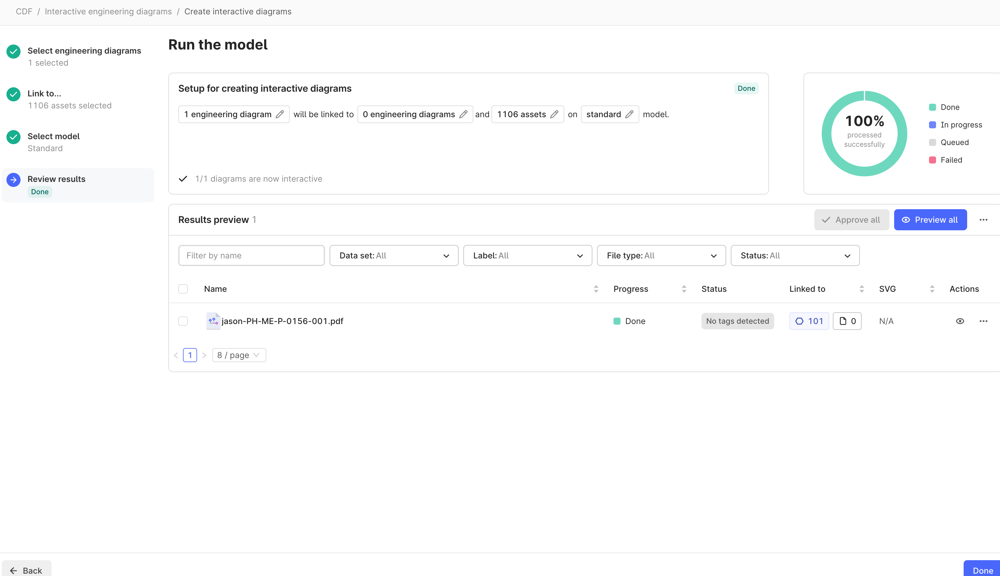
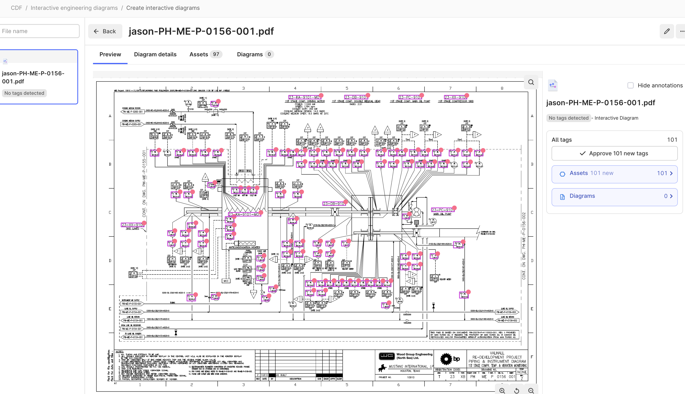

# Valhall demo data

## Load CSV to CDF staging
[1.0-load_raw.py](./../cdf/valhall/1.0-load_raw.py)
The above python file loads the csv files into CDF Staging using the python SDK. Alternatively, you could have drag'd and drop'd the file directly into the Fusion UI, OR you could have used a CSV Extractor.

[source_assets.csv](./../cdf/valhall/data/source_assets.csv)
[source_timeseries.csv](./../cdf/valhall/data/source_timeseries.csv)

### Load Assets and Timeseries using Transformations

!!! TODO
    - Create a Transformation using the following SQL
    [2.1-valhall-assets.sql](./../cdf/valhall/2.1-valhall-assets.sql)
    [2.2-valhall-timeseries-metadata.sql](./../cdf/valhall/2.2-valhall-timeseries-metadata.sql)
    - ENSURE you change the targe dataSetId

### Contextualize Timeseries to Assets
!!! TODO
    Contextualize >> Match entities
    
    
    
    
    

## P&IDs

[3.0-load_pnid.py](./../cdf/valhall/3.0-load_pnid.py)

!!! TODO
    - Run the python script. Be sure to change the datasetId and your filename
    - Verify that your files have loaded

### Contextualization
!!! TODO
    Contextualize >> Interactive engineering diagrams
    
    Select PH-ME-P-0156-001.pdf
    
    Skip linking to other diagrams
    Ensure you filter to the correct root Asset (AkerBP)
    
    - You should have 1106 assets selected for matching
    - Select the Standard Model
    - Select Run
    

    
    
